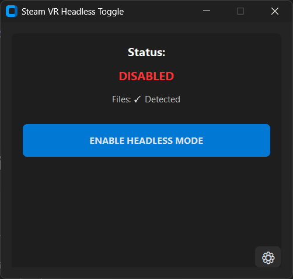
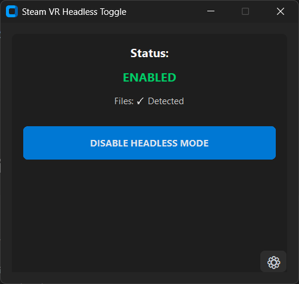

# SteamVR Headless Toggle

A Windows application that allows you to easily toggle SteamVR's simulated (null driver) mode on and off with a single button press. This enables you to run SteamVR without a physical VR headset attached.

## Features

- **One-Click Toggle**: Enable or disable VR headless mode with a single button
- **Virtual Controllers**: Automatically spawn virtual VR controllers when headless mode is enabled
  - Configure number of controllers (0-4)
  - Controllers appear in SteamVR and are recognized by VR applications
  - User-configurable with slider and checkbox
- **Auto-Detection**: Automatically finds your Steam installation and SteamVR configuration files
- **Dark Mode UI**: Modern, clean dark-themed interface
- **Smart Admin Elevation**: Only requests administrator privileges when needed
- **Safe File Modification**:
  - Creates automatic backups before any changes
  - Atomic file operations to prevent corruption
  - Automatic rollback on errors
  - Preserves all other settings in configuration files
- **Status Indicators**: Clear visual feedback showing current state and file status
- **Manual Configuration**: Browse for files if auto-detection fails

## Screenshots

### Disabled State


### Enabled State


The application features:
- Colored status indicator showing current state (green when enabled, red when disabled)
- Toggle button that changes text based on state (ENABLE/DISABLE HEADLESS MODE)
- Settings dialog for manual file path configuration
- Auto-detect functionality for finding Steam files

## Requirements

- Windows 10 or later
- SteamVR installed
- Python 3.10+ (for development)

## Installation

### Option 1: Download Executable (Recommended)

1. Download `SteamVR-Headless-Toggle.exe` from the releases page
2. Run the executable
3. The app will auto-detect your Steam installation
4. If files aren't found automatically, click the settings gear icon to manually browse for them

### Option 2: Run from Source

1. Clone this repository:
   ```bash
   git clone https://github.com/yourusername/steam-simulated-vr-headset-toggle.git
   cd steam-simulated-vr-headset-toggle
   ```

2. Install dependencies:
   ```bash
   pip install -r requirements.txt
   ```

3. Run the application:
   ```bash
   python src/main.py
   ```

## Usage

### First Run

1. Launch the application
2. The app will attempt to auto-detect your Steam installation
3. If successful, you'll see "Files: ✓ Detected" and a green status indicator
4. If not, click the settings gear (⚙) and either:
   - Click "Auto-Detect Paths" to try again
   - Click "Browse" to manually select each file

### Toggling VR Mode

1. Click the main toggle button
2. If admin privileges are needed, you'll be prompted to restart with elevation
3. The button text will change to show the new state:
   - "ENABLE VR MODE" when currently disabled
   - "DISABLE VR MODE" when currently enabled
4. Status indicator shows current state with color coding:
   - Green: Ready and working correctly
   - Yellow: Files found but in unknown state
   - Red: Error or files not found

### File Locations

The app modifies two files in your Steam directory:

**Null Driver File:**
```
{Steam}/steamapps/common/SteamVR/drivers/null/resources/settings/default.vrsettings
```

**SteamVR Config File:**
```
{Steam}/steamapps/common/SteamVR/resources/settings/default.vrsettings
```

## What It Does

### Headless Mode

When you enable VR headless mode, the app modifies the following settings:

### Null Driver File
```json
{
  "driver_null": {
    "enable": true  // Changed from false
  }
}
```

### SteamVR Config File
```json
{
  "steamvr": {
    "requireHmd": false,              // Changed from true
    "forcedDriver": "null",           // Changed from ""
    "activateMultipleDrivers": true   // Changed from false
  }
}
```

When you disable VR headless mode, these settings are reverted to their original values.

### Virtual Controllers

When virtual controllers are enabled, the app **automatically**:
1. Installs a pre-built virtual controller driver to SteamVR when you enable headless mode
2. Configures the number of controllers (0-4) based on your slider setting
3. The controllers appear in SteamVR and can be used by VR applications
4. Removes the driver from SteamVR when you disable headless mode

**No manual setup required!** The driver is pre-built and bundled with the application.

## Safety Features

- **Automatic Backups**: Creates timestamped backups before every modification
- **Atomic Operations**: Uses temporary files and atomic renames to prevent corruption
- **Rollback on Failure**: Automatically restores from backup if any error occurs
- **Validation**: Verifies file structure before and after modifications
- **Precise Editing**: Only modifies target settings, preserves all other values

## How It Works

### Automatic Driver Management

The virtual controller driver is **pre-built and bundled** with the application. No manual setup needed!

**When you enable headless mode:**
- The app automatically installs the driver to: `SteamVR/drivers/virtual_controller/`
- Configures it with your chosen controller count
- Controllers appear in SteamVR immediately

**When you disable headless mode:**
- The app automatically removes the driver from SteamVR
- Clean uninstall, no files left behind

### Building the Driver (For Developers)

The driver is automatically built using GitHub Actions. If you want to rebuild it:

1. Push changes to the `driver_source/` folder
2. GitHub Actions will automatically compile the driver
3. Download the built DLL from the Actions artifacts
4. Or use the workflow: `.github/workflows/build-driver.yml`

## Configuration

The app stores its configuration in:
```
config/app_config.json
```

This file contains:
- File paths to SteamVR configuration files
- Last known toggle state
- Virtual controller settings (enabled, count)
- Backup settings

## Building from Source

To build the standalone executable:

```bash
python build_exe.py
```

The executable will be created in the `dist/` folder.

## Development

### Project Structure

```
steam-simulated-vr-headset-toggle/
├── src/
│   ├── main.py                     # Entry point
│   ├── ui/
│   │   ├── main_window.py          # Main GUI window
│   │   ├── settings_dialog.py      # Settings dialog
│   │   └── styles.py               # UI styling constants
│   ├── core/
│   │   ├── file_manager.py         # Safe JSON operations
│   │   ├── state_manager.py        # Toggle logic
│   │   ├── config_manager.py       # App configuration
│   │   ├── controller_manager.py   # Virtual controller management
│   │   └── path_detector.py        # Steam directory detection
│   └── utils/
│       ├── admin_utils.py          # UAC elevation
│       └── validators.py           # File validation
├── drivers/
│   └── virtual_controller/         # Virtual controller driver
│       ├── driver.vrdrivermanifest # Driver manifest
│       ├── bin/win64/              # Place driver DLL here
│       ├── resources/settings/     # Driver configuration
│       └── README.md               # Driver setup instructions
├── config/                         # Configuration storage
├── backups/                        # Automatic backups
├── requirements.txt                # Python dependencies
├── build_exe.py                    # Build script
└── README.md                       # This file
```

### Dependencies

- **customtkinter**: Modern UI framework
- **Pillow**: Image processing
- **pywin32**: Windows API access
- **darkdetect**: Dark mode detection
- **pyinstaller**: Executable creation

## Troubleshooting

### Files Not Detected

1. Click the settings gear icon (⚙)
2. Click "Auto-Detect Paths"
3. If still not found, manually browse to:
   - Usually in `C:\Program Files (x86)\Steam\`
   - Or check where you installed Steam

### Permission Denied

1. The app will prompt for administrator elevation when needed
2. Click "Yes" to restart with admin privileges
3. Some antivirus software may block the elevation - add an exception if needed

### Changes Don't Work

1. Close SteamVR before toggling
2. Verify both files are detected (check settings)
3. Check the backups folder for recent backups if you need to restore manually
4. If using virtual controllers, restart SteamVR after enabling them

### Virtual Controllers Not Appearing

1. Check that the checkbox "Enable virtual controllers with headless mode" is checked
2. Make sure you disabled and then re-enabled headless mode (this installs the driver)
3. Close SteamVR completely, then launch it again
4. Check controller count is set to at least 1 (use the slider)
5. Check SteamVR logs for errors: `C:\Program Files (x86)\Steam\logs\vrserver.txt`

### Config Reset

If you need to reset the configuration:
1. Close the app
2. Delete `config/app_config.json`
3. Restart the app - it will recreate default config

## Backups

Backups are stored in the `backups/` folder with timestamps:
```
backups/
├── default.vrsettings.backup.2025-12-28_103045
└── default.vrsettings.backup.2025-12-28_110230
```

By default, the app keeps the 5 most recent backups. You can manually restore a backup by copying it over the original file.

## License

This project is open source and available under the MIT License.

## Contributing

Contributions are welcome! Please feel free to submit a Pull Request.

## Credits

Based on the guide: [Running SteamVR without a headset attached](running-SteamVR-without-a-headset-attached.md)

## Disclaimer

This tool modifies SteamVR configuration files. While it includes safety features like automatic backups and rollback, use at your own risk. Always ensure you have backups of important data.
